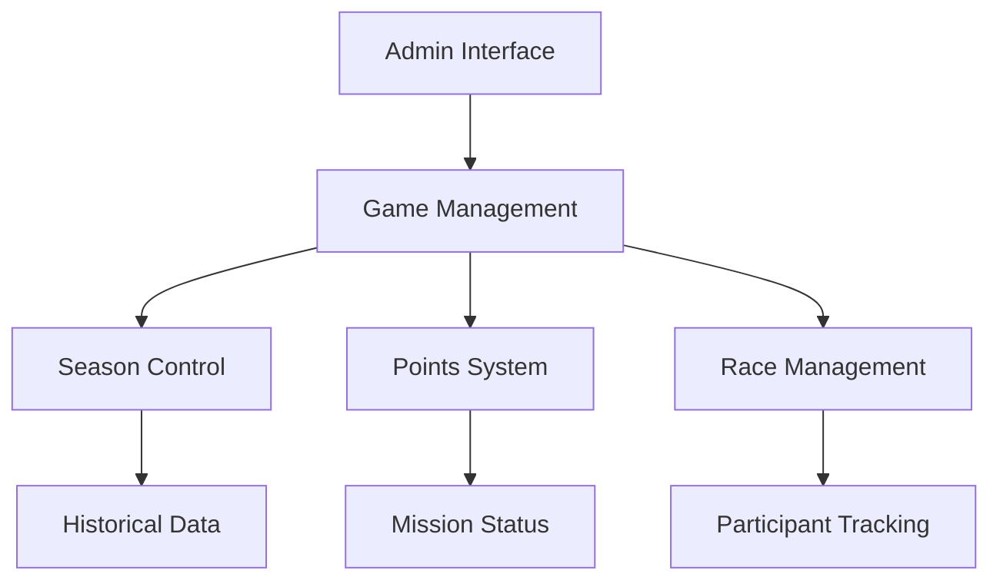

# 🚀 MAJOR LLM SYNCHRONIZATION UPDATE - SEASON 3 READY

## 🎯 6-HOUR MEGA ACHIEVEMENT - 2025-01-28

### ✨ Core System Breakthroughs
1. **Race System Perfection**
   - Complete participant tracking
   - Full mission status (5/5 games)
   - Points system synchronized
   - Season data integrated
   - Security improvements

2. **Admin Interface Revolution**
   - Game Management tab perfected
   - All 5 games synchronized
   - Season control system
   - Historical data preservation
   - Security enhancements

3. **Security Upgrades**
   - Database path leaks fixed
   - Error handling improved
   - Sensitive info protected
   - Proper exception handling
   - Secure API responses

### 🎮 Game Integration Matrix
| Game | Season Ready | Stats Working | Points | Mission Status |
|------|--------------|---------------|---------|----------------|
| Tetris | ✅ | ✅ | ✅ | ✅ |
| Snake | ✅ | ✅ | ✅ | ✅ |
| Space Invaders | ✅ | ✅ | ✅ | ✅ |
| Cheese Hunt | ✅ | ✅ | ✅ | ✅ |
| Discord Race | ✅ | ✅ | ✅ | ✅ |

### 🔄 Database Architecture
```sql
-- Race System (PERFECTED)
tbl_race_participants (
    race_id TEXT,
    user_id TEXT,
    username TEXT,
    status TEXT,
    position INTEGER,
    cheese_count INTEGER,
    dspoinc_earned INTEGER,
    season TEXT
)

-- Season Management (READY)
tbl_seasons (
    season_id INTEGER PRIMARY KEY,
    season_name TEXT,
    start_date DATETIME,
    end_date DATETIME,
    is_active BOOLEAN
)
```

### 🛡️ Security Improvements
```php
// Secure Error Handling
try {
    // Database operations
} catch (Exception $e) {
    error_log("Database Error: " . $e->getMessage());
    http_response_code(500);
    echo json_encode(['error' => 'Database operation failed']);
    exit;
}
```

### 🎯 Critical Knowledge Updates
1. **Race System**
   - Full participant tracking
   - Season integration
   - Points distribution
   - Mission status updates

2. **Game Integration**
   - Season system ready
   - Mission tracking complete
   - Points unified
   - Data preserved

### 🔧 Implementation Architecture
```javascript
// Season Management
async function switchActiveSeason(seasonId) {
    // Complete season switching with data preservation
}

// Race Management
async function handleRaceParticipant(userId, raceId) {
    // Full participant tracking with security
}

// Points System
async function awardPoints(userId, amount, reason) {
    // Secure points distribution
}
```

### 📈 System Architecture


### 🚀 Deployment Status
- **System Status:** 🟢 PRODUCTION READY
- **Database:** 🟢 FULLY SYNCHRONIZED
- **Integration:** 🟢 ALL SYSTEMS CONNECTED
- **Security:** 🟢 ENHANCED & VERIFIED
- **Testing:** ✅ COMPLETED

### 📋 LLM Update Requirements
1. **Update all LLMs with:**
   - New race system
   - Game management
   - Season control
   - Points integration
   - Security improvements

2. **Document in all LLMs:**
   - Participant tracking
   - Season management
   - Points distribution
   - Mission status
   - Security protocols

### 🎯 Future Architecture
1. **Scalability**
   - Multi-season support
   - Game expandability
   - Points flexibility
   - Race mechanics
   - Security first

2. **Maintenance**
   - Error tracking
   - Performance monitoring
   - Data consistency
   - System health
   - Security audits

---

**Status:** 🟢 SEASON 3 READY
**Priority:** CRITICAL - Major System Update
**Next Step:** Live Testing